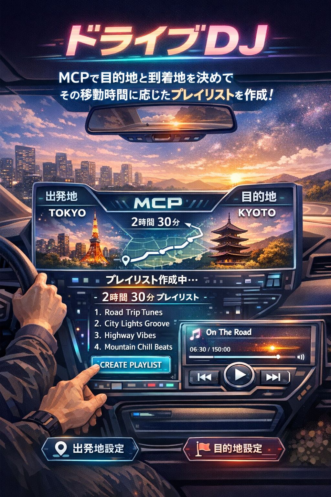

# davadava - ドライブDJ

> MCPで出発地と目的地を決めて、その移動時間に応じたプレイリストを作成!



VoiceOS + MCP + Google Maps + Spotify で動く**音声DJアプリ**。
ドライブの目的地・移動時間・気分に応じて、最適な曲を自動で選曲・再生します。

## 特徴

- **出発地 × 目的地** → Google Maps でルート計算 → 移動時間に合ったプレイリストを自動生成
- **目的地の雰囲気** → ビーチ、山、都市、高速...場所に合った選曲
- **タスク・モチベ対応** → 集中、運動、リラックスなど作業BGMも
- **アーティスト指名** → 「Zutomayoかけて」で正確に検索・再生
- **完全ハンズフリー** → VoiceOS で音声操作、ドライブ中も安全

## 音声コマンド例

| 話しかけ方 | 実行される機能 |
|-----------|--------------|
| 「東京から京都までドライブ、曲かけて」 | ルート計算 → 2時間30分に合うプレイリスト再生 |
| 「海に向かうからいい曲かけて」 | ビーチドライブ向け選曲 |
| 「渋谷から横浜までの時間を見て、合う曲を流して」 | ルート距離/時間を取得して最適プレイリスト再生 |
| 「夜のドライブに合う曲」 | 夜ドライブ向けの lo-fi / R&B |
| 「集中したいから作業用BGM流して」 | 集中向け lo-fi / ambient |
| 「Zutomayoの曲かけて」 | Spotify でアーティスト検索 → 再生 |
| 「テンション上げたい」 | ハイエネルギーな曲 |
| 「次の曲」 | スキップ |
| 「音量下げて」 | 音量調整 |
| 「今なんの曲?」 | 曲情報を返答 |

## セットアップ

```bash
pip install -r requirements.txt
```

### API キーの設定

`src/.env` を作成:

```bash
SPOTIPY_CLIENT_ID=your_client_id
SPOTIPY_CLIENT_SECRET=your_client_secret
SPOTIPY_REDIRECT_URI=http://localhost:8888/callback
GOOGLE_MAPS_API_KEY=your_google_maps_api_key
```

Spotify 認証:
```bash
python3 src/setup_spotify.py
```

## VoiceOS への接続

1. VoiceOS を開く
2. **設定 → 連携 → カスタム連携** に移動
3. **追加** → 名前: `davadava-dj` → 起動コマンド:

```bash
python3 /path/to/davadava/src/dj_server.py
```

## アーキテクチャ

```
音声 → VoiceOS → MCP Server (dj_server.py)
                    ├── Google Maps API → ルート計算・場所判定
                    ├── Spotify Web API → 検索・再生
                    └── AppleScript     → Spotify 操作
```

## ドキュメント

- [VoiceOS MCP できること一覧](docs/voiceos-mcp-overview.md)
